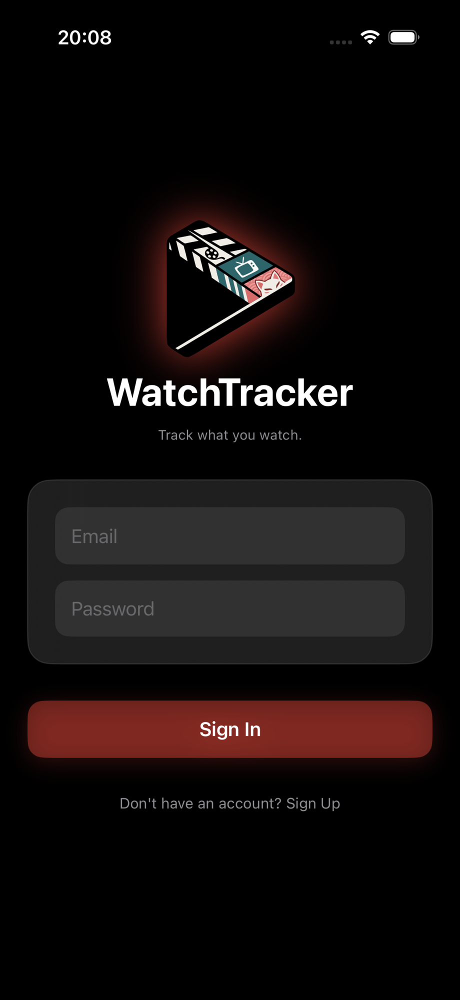
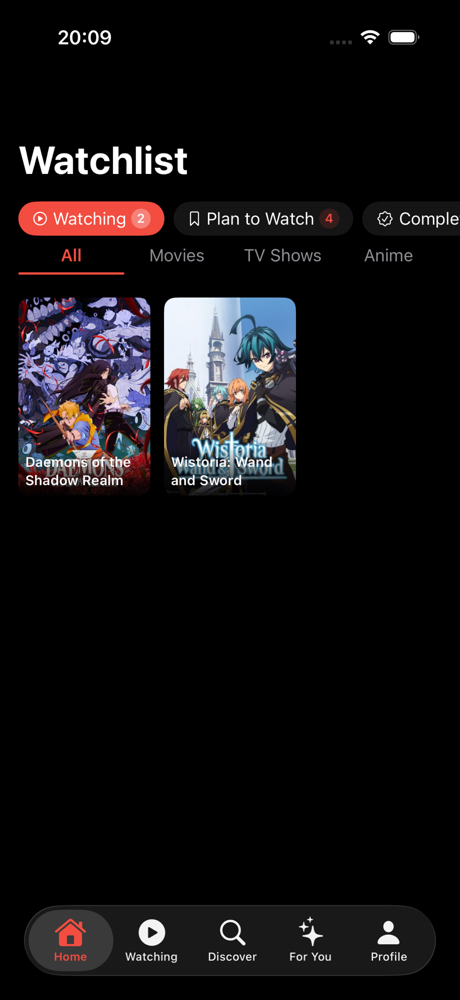
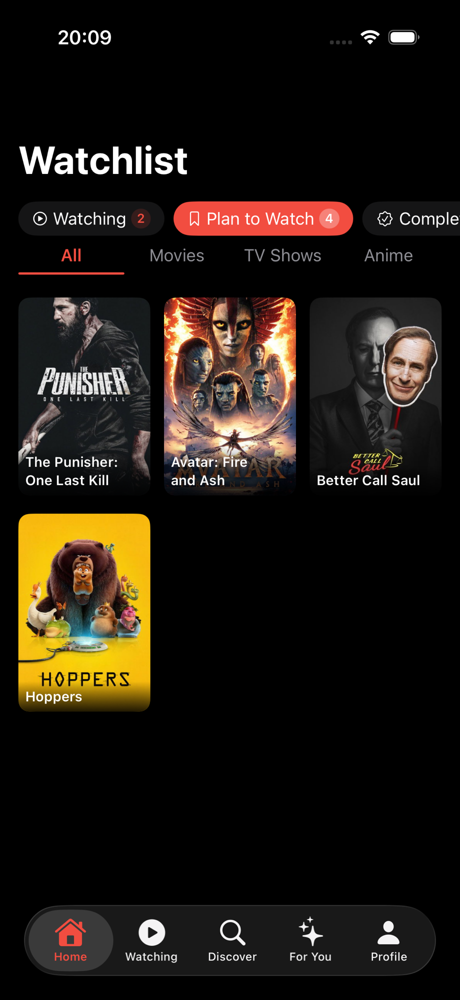
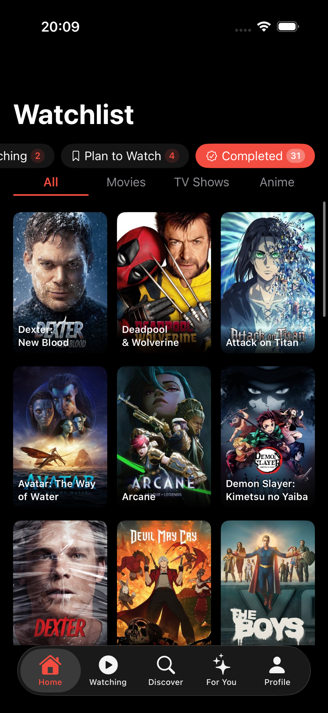
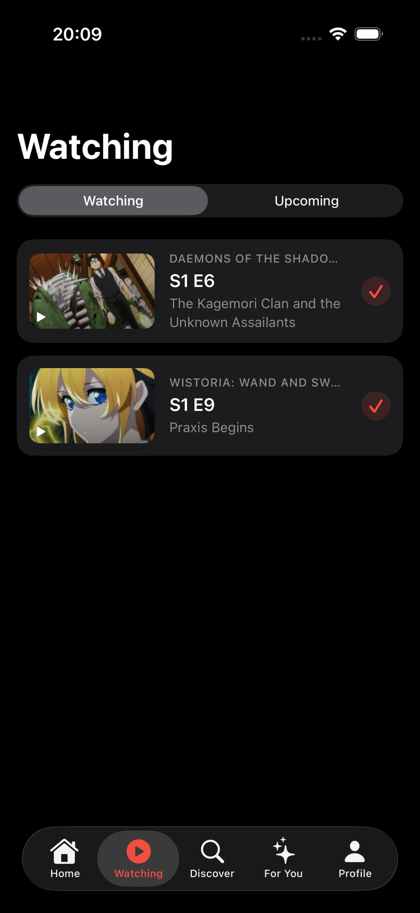
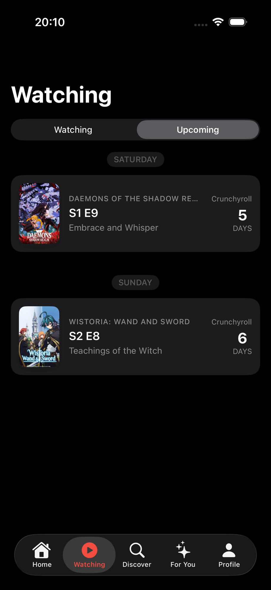
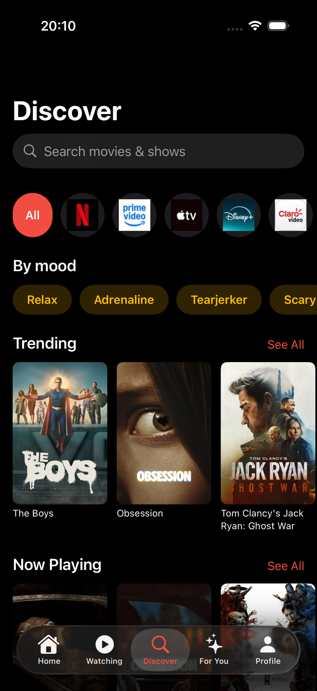
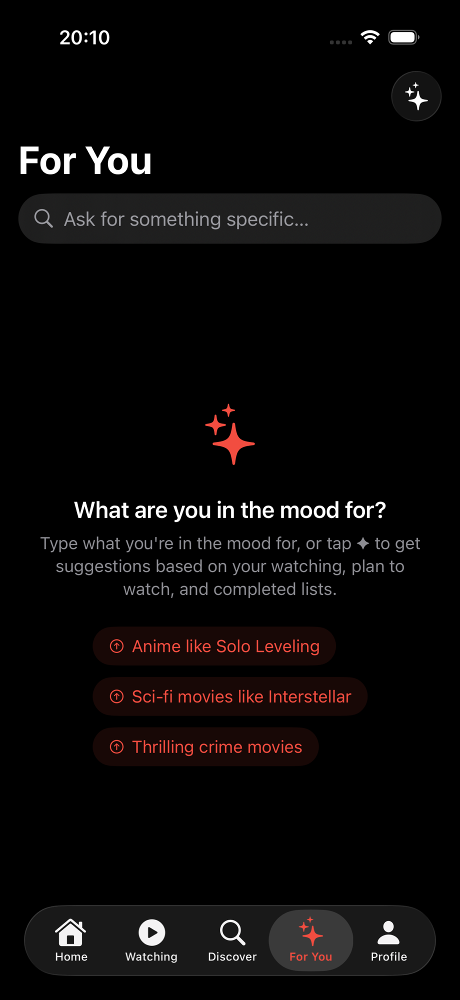
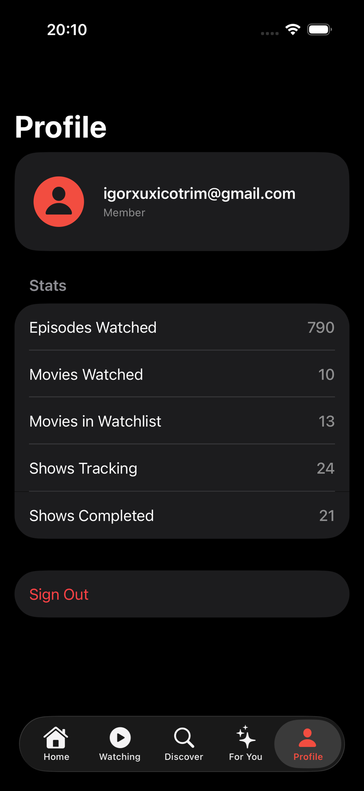

# WatchTracker — iOS

Native iOS app for tracking movies and TV shows. Built with SwiftUI and powered by a custom Express.js backend. Part of the `movie_tracker` monorepo — see `../README.md` for the full-stack overview.

## Screenshots

<div align="center">
  
  
  
  
  
  
  
  
  
</div>

## Features

- **Watchlist** — Add movies and TV shows with status (watching, plan to watch, completed, dropped). Filter by type and status.
- **Discover** — Browse trending, now playing, top-rated, and upcoming content. Search with suggestions and history. Filter by genre, streaming provider, country, and mood presets.
- **Continue Watching** — Resume TV series from your next unwatched episode.
- **Upcoming** — See episodes from shows you're watching that haven't aired yet.
- **Detail** — Full media page with cast, synopsis, where to watch, season/episode tracking, and star ratings.
- **AI Suggestions** — Personalized recommendations powered by Apple Intelligence (on-device, via `FoundationModels`). Falls back gracefully when unavailable.
- **Profile** — Viewing stats and sign-out.

## Tech Stack

| Layer | Technology |
|---|---|
| UI | SwiftUI |
| Architecture | MVVM — `@Observable` ViewModels |
| Auth | Supabase Swift SDK v2.5.1+ |
| Networking | Custom `actor`-based `APIClient` |
| Localization | `Localizable.xcstrings` + typesafe `Strings` enum |
| AI | Apple `FoundationModels` (`SystemLanguageModel`) |
| Backend | Express.js API — see `../backend/` |

## Getting Started

1. Open `WatchTracker/WatchTracker.xcodeproj` in Xcode.
2. Xcode resolves the single SPM dependency (Supabase Swift) automatically.
3. Build and run (⌘R) on a simulator or device running iOS 18+.

No CLI scripts or additional configuration needed. The app connects to the production backend at `https://watch-tracker-backend-916835188736.southamerica-east1.run.app/api`. To point at a local backend, update `Config.apiBaseURL` in `App/Config.swift`.

> **AI Suggestions** require a device with Apple Intelligence enabled. The feature shows a graceful unavailable state on ineligible simulators and devices.

## Project Structure

```
WatchTracker/WatchTracker/
├── App/                        # Entry point, tab navigation, Config
├── Components/                 # Cross-feature reusable views
│   ├── PosterCardView
│   ├── SkeletonView
│   ├── ErrorStateView
│   ├── StreamingBadgeView
│   └── ...
├── Core/
│   ├── Network/                # APIClient (actor), Endpoint enum, APIError
│   ├── Services/               # AuthService, WatchlistService, DiscoverService,
│   │                           # MediaDetailService, AIService, SearchHistoryManager
│   ├── Models/                 # Codable domain models
│   └── Extensions/             # Color+Extensions, Strings (localization)
└── Features/
    ├── Auth/                   # Sign-in / sign-up flow
    ├── Home/                   # Watchlist with filters
    ├── Discover/               # Search, trending, browse by genre/provider/mood
    ├── Watching/               # Continue watching + upcoming episodes
    ├── Detail/                 # Media detail page
    ├── Profile/                # Stats and account
    └── AI/                     # Apple Intelligence suggestions
```

## Architecture

Data flows in one direction: **View → ViewModel → Service → APIClient**.

- **Views** hold `@State var viewModel: SomeViewModel` and trigger async work via `.task { }`.
- **ViewModels** use the `@Observable` macro and expose `isLoading`, `errorMessage`, and domain state.
- **Services** (`WatchlistService`, `DiscoverService`, `MediaDetailService`) are thin wrappers that translate operations into `Endpoint` cases.
- **`APIClient`** is an `actor` singleton. It auto-injects the Supabase bearer token, encodes/decodes snake_case ↔ camelCase, and surfaces typed `APIError` values.
- **`AuthService`** is the single `ObservableObject` in the app, injected at the root via `@EnvironmentObject`. It gates the entire UI and reacts to Supabase auth state changes in real time.

## Localization

All user-facing strings must go through `Core/Extensions/Strings.swift` and `Localizable.xcstrings`. Never hardcode UI copy as string literals in Swift. See `mobile/CLAUDE.md` for the full localization rules.

## Tests

Unit tests live in `WatchTracker/WatchTrackerTests/`. They cover ViewModels, models, and services using protocol-based mocks (`MockWatchlistService`, `MockDiscoverService`, `MockMediaDetailService`). Run with ⌘U in Xcode.
